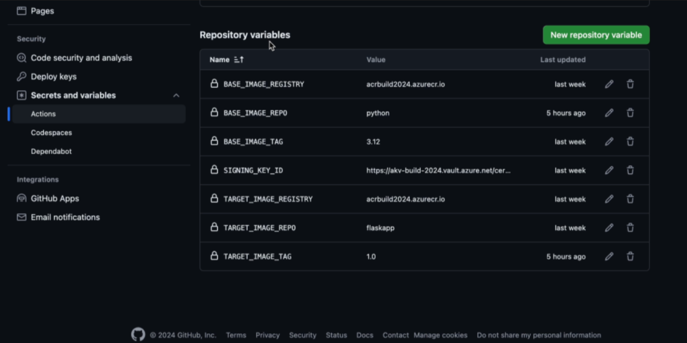
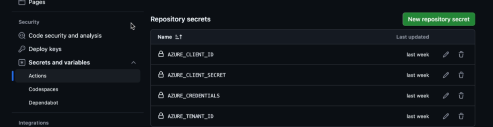

# cssc-flaskapp
Repository for CSSC's flask app

### Github actions variables

* BASE_IMAGE_REGISTRY
* BASE_IMAGE_REPO
* BASE_IMAGE_TAG
* SIGNING_KEY_ID
* TARGET_IMAGE_REGISTRY
* TARGET_IMAGE_REPO
* TARGET_IMAGE_TAG

### Github secrets and variables

* AZURE_CLIENT_ID
* AZURE_CLIENT_SECRET
* AZURE_CREDENTIALS
* AZURE_TENANT_ID

### Source Registry
* SOURCE_IMAGE_REGISTRY

## Prerequisites
* docker desktop
* skopeo (can be installed using homebrew)
* az cli
* helm

## Configure an ACR
Create an ACR. The name will be BASE_IMAGE_REGISTRY and TARGET_IMAGE_REGISTRY.

## Configure a Source Registry
Create a registry on Docker Hub. This will be SOURCE_IMAGE_REGISTRY. Create a public repository in the registry and call it `python`.

Run `skopeo docker login` to gain image push access.

Run `skopeo copy -a docker://docker.io/library/python:3.12.2 docker://<SOURCE_IMAGE_REGISTRY>/python:3.12`. This will copy the vulnerable python:3.12.2 image into your source registry and tag it as python:3.12.

Run `skopeo copy -a docker://docker.io/library/nginx:1.23.2 docker://<SOURCE_IMAGE_REGISTRY>/nginx:1.23`. This will copy the vulnerable nginx:1.23.2 image into your source registry and tag it as nginx:1.23.

In the next step, artifact sync will be configured to sync with python:3.12 from your source registry into your ACR configured in the previous step. You'll do the same for the nginx:1.23 image.

## Configure Artifact Sync
Request access to artifact sync by sending subscription ID to Luis/Tony. Visit the Preview Azure Portal at https://aka.ms/acr/portal/preview. These steps are only necessary since artifact sync is not yet released.

Navigate to "Services" tab on the left > "Cache" > "Create rule"

Create a "Cache rule name." Set the "Source" to `Docker Hub`, "Repository path" to SOURCE_IMAGE_REGISTRY, and "New ACR repository namespace" to `python`. Check the "Artifact sync" box and click on "Configure."

Select "Sync by a tag" under "Select artifacts." Click "Preview tags for Artifact Sync" to confirm that the `python:3.12` image will be synced. Save and create the rule. Confirm that the sync was successful under "Repositories."

Repeat this process for the nginx:1.23 image.

Now, if you run `skopeo copy -a docker://docker.io/library/python:3.12.3 docker://<SOURCE_IMAGE_REGISTRY>/python:3.12`, artifact sync will pull the new python:3.12.3 image into your acr. (NOTE: Do not perform this step if you'd like to follow along with our examples using python:3.12.2).

## Configure Continuous Patching Workflow
Run `az extension add --source acrcssc-0.1.0-py3-none-any.whl` to install the continuous patching extension. This step is only necessary since continuous patching is not yet released.

Run `az acr supply-chain workflow create --cadence 1d --config ./src/cont-patch-config.json -r <BASE_IMAGE_REGISTRY> -g <RESOURCE_GROUP> -t continuouspatchv1` to create the workflow.

## Build the flaskapp Image
Follow this guide to set up a service principal and authenticate using Workload Identity Federation: https://dev.to/massimobonanni/azure-workload-identity-federation-and-github-actions-pf7. NOTE: You must use Workload Identity Federation--do not generate a secret. Secrets will internally flag your service principal and will not be compatible with the Github action.

After, grant your service principal Contributor access to your subscription.

## Deploy Python and Nginx Images Using Helm
On docker desktop, go to "Settings" on the top right > "Kubernetes" > select "Enable" and "Show system containers (advanced)" > "Apply & restart." NOTE: Sometimes, docker desktop will be stuck on "Kubernetes is starting..." To fix this, shut down your laptop and start it again (do not click restart but shut down).

Run `kubectl config use-context docker-desktop.` Confirm this worked properly by running `kubectl get nodes`. You should see a docker-desktop node.

Create a docker registry secret so that the helm chart can pull images from TARGET_IMAGE_REGISTRY. Run `az acr credential show --name <TARGET_IMAGE_REGISTRY>`. Run `kubectl create secret docker-registry acr-secret --docker-server=<TARGET_IMAGE_REGISTRY> --docker-username=<username> --docker-password=<password>`.

Deploy the helm chart by running `helm install mychart ./mychart`. Run `kubectl port-forward svc/mychart 3000:80` so that you can access the deployment at http://localhost:3000. If you run into issues, debug using `kubectl get pods` and `kubectl logs`.

